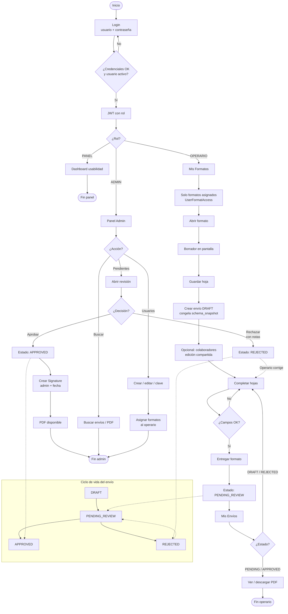

# Diagrama de flujo — Colbeef-Ops

Flujo unificado del sistema: autenticación, roles, diligenciamiento, revisión y ciclo de vida de envíos.

## Resumen

1. El usuario inicia sesión y recibe un JWT según su rol (`OPERARIO`, `ADMIN` o `PANEL`).
2. El **operario** solo ve los formatos asignados, llena el formulario, guarda un borrador (`DRAFT`) y lo entrega a revisión (`PENDING_REVIEW`). Al crear el borrador se congela `schema_snapshot` (compatibilidad: cambios de catálogo no alteran ese envío).
3. Puede haber **colaboradores** en el mismo borrador; dueño y colaboradores pueden editar (y sobrescribir) los mismos campos.
4. El **admin** revisa pendientes: aprueba (crea firma) o rechaza (el operario/colaboradores corrigen y reenvían).
5. El admin también gestiona usuarios y permisos de formatos, y puede buscar envíos.
6. El rol **PANEL** solo accede al dashboard de usabilidad.
7. Detalle del modelo: [diagrama-uml-base-datos.md](./diagrama-uml-base-datos.md). Colaboración: [colaboracion-formatos.md](./colaboracion-formatos.md).
