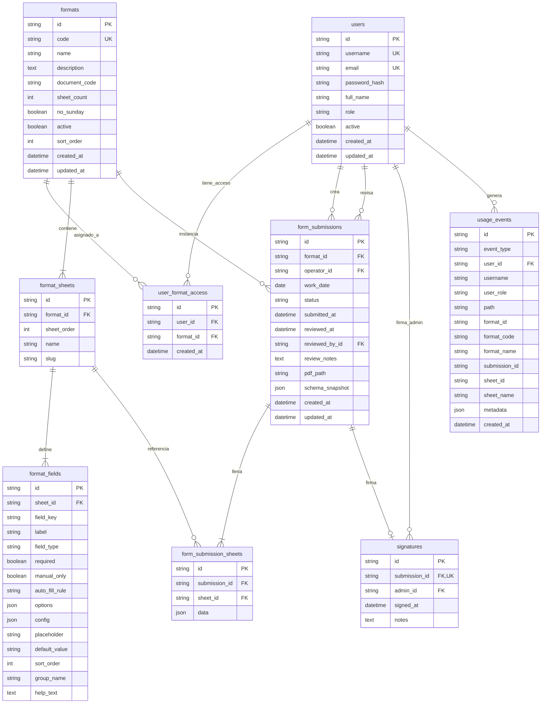

# Diagrama UML / ER — Base de datos Colbeef-Ops

Modelo relacional según `backend/prisma/schema.prisma` (MySQL).

> **Cómo pegar en [mermaid.live](https://mermaid.live):** copia **solo** desde `erDiagram` hasta el final del diagrama.  
> **No** copies las líneas \`\`\`mermaid ni \`\`\`.

## Enums

| Enum | Valores |
|------|---------|
| `UserRole` | `ADMIN`, `OPERARIO`, `PANEL` |
| `SubmissionStatus` | `DRAFT`, `PENDING_REVIEW`, `APPROVED`, `REJECTED` |
| `FieldType` | `TEXT`, `TEXTAREA`, `NUMBER`, `DATE`, `TIME`, `DATETIME`, `CHECKBOX`, `CHECKLIST`, `SELECT`, `MULTI_SELECT`, `RADIO`, `SIGNATURE`, `AUTO`, `READONLY`, `REPEATER`, `PHOTO` |
| `AutoFillRule` | `CURRENT_DATE`, `CURRENT_TIME`, `CURRENT_DATETIME`, `CURRENT_USER`, `CURRENT_USER_NAME`, `FIXED_VALUE`, `DAY_SCHEDULE`, `CALC_MAP` |
| `UsageEventType` | `LOGIN`, `LOGIN_FAILED`, `LOGOUT`, `PAGE_VIEW`, `SUBMISSION_CREATED`, `SHEET_SAVED`, `SUBMISSION_SUBMITTED`, `SUBMISSION_SUBMITTED_FAILED`, `SUBMISSION_APPROVED`, `SUBMISSION_REJECTED`, `SUBMISSION_DELETED`, `SUBMISSION_OPENED`, `PDF_DOWNLOADED`, `SEARCH_EXECUTED`, `PENDING_VIEWED` |

## Relaciones clave

| Desde | Hasta | Cardinalidad | Descripción |
|-------|-------|--------------|-------------|
| `users` | `user_format_access` | 1:N | Formatos que puede diligenciar un operario |
| `formats` | `format_sheets` | 1:N | Hojas del formato |
| `format_sheets` | `format_fields` | 1:N | Campos de cada hoja |
| `users` | `form_submissions` | 1:N | Envíos creados por el operario |
| `users` | `form_submissions` | 1:N | Envíos revisados por el admin |
| `form_submissions` | `form_submission_sheets` | 1:N | Datos JSON por hoja |
| `form_submissions` | `signatures` | 1:0..1 | Firma al aprobar |
| `users` | `usage_events` | 1:N | Telemetría de usabilidad |

## Dónde visualizar y exportar

1. **[Mermaid Live Editor](https://mermaid.live)** *(recomendado)*  
   - Copia el bloque `mermaid` de este archivo.  
   - Pégalo en https://mermaid.live  
   - Usa **Actions → PNG / SVG** para exportar.

2. **VS Code / Cursor**  
   - Extensión *Markdown Preview Mermaid Support* o *Mermaid*.  
   - Abre este `.md` → Preview → captura o exporta según la extensión.

3. **GitHub**  
   - Sube el archivo al repo: GitHub renderiza Mermaid solo.  
   - Para exportar imagen: abre en Mermaid Live o usa captura.

4. **Prisma ERD (opcional)**  
   - En `backend`: `npx prisma generate` con un generador ERD, o herramientas como [prisma-erd-generator](https://github.com/keonik/prisma-erd-generator).  
   - Genera diagrama directo desde `schema.prisma`.

5. **dbdiagram.io**  
   - Puedes reescribir el modelo en DBML y exportar PNG/PDF desde https://dbdiagram.io
