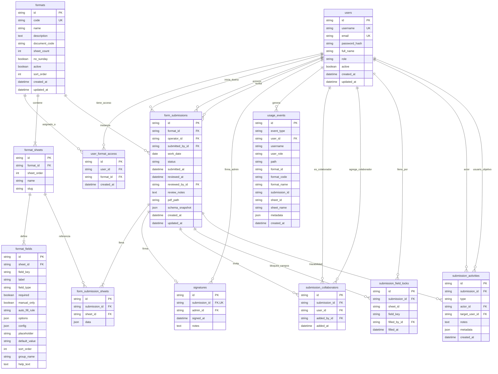

# Diagrama UML / ER — Base de datos Colbeef-Ops

Modelo relacional según `backend/prisma/schema.prisma` (MySQL).

Incluye: catálogo de formatos, permisos por operario, envíos, **compatibilidad de esquema** (`schema_snapshot`), colaboración y telemetría.

> **Cómo pegar en [mermaid.live](https://mermaid.live):** copia **solo** desde `erDiagram` hasta el final del diagrama (antes del cierre \`\`\`).  
> **No** copies las líneas \`\`\`mermaid ni \`\`\`.

## Compatibilidad de formatos (`schema_snapshot`)

Al **crear el borrador** (y de nuevo al entregar si faltara), el sistema guarda en `form_submissions.schema_snapshot` una copia del esquema de hojas y campos vigentes.

| Situación | Qué usa el envío |
|-----------|------------------|
| Borrador / enviado / aprobado / rechazado **con** snapshot | Campos del snapshot (congelados) |
| Cambio de catálogo vía `db:seed` | Solo afecta **nuevos** envíos (sin snapshot previo) |
| Ver ficha, validar, PDF | Se aplica `applySchemaSnapshotToFormat` |

**Regla operativa:** se puede cambiar un formato en seed/UI sin alterar documentos ya iniciados o enviados.

**Excepción PDF (solo presentación):** al descargar, el PDF se **regenera** con el motor actual (filas dinámicas, cabeceras de continuación, numeración, campos vacíos con línea excepto observaciones). Eso no cambia los datos ni el esquema congelado; solo el layout del archivo. La hoja de trazabilidad/colaboración solo se incluye si el envío tiene colaboradores.

Código de referencia: `backend/src/utils/schemaSnapshot.ts`.

## Enums

| Enum | Valores |
|------|---------|
| `UserRole` | `ADMIN`, `OPERARIO`, `PANEL` |
| `SubmissionStatus` | `DRAFT`, `PENDING_REVIEW`, `APPROVED`, `REJECTED` |
| `FieldType` | `TEXT`, `TEXTAREA`, `NUMBER`, `DATE`, `TIME`, `DATETIME`, `CHECKBOX`, `CHECKLIST`, `SELECT`, `MULTI_SELECT`, `RADIO`, `SIGNATURE`, `AUTO`, `READONLY`, `REPEATER`, `PHOTO` |
| `AutoFillRule` | `CURRENT_DATE`, `CURRENT_TIME`, `CURRENT_DATETIME`, `CURRENT_USER`, `CURRENT_USER_NAME`, `FIXED_VALUE`, `DAY_SCHEDULE`, `CALC_MAP` |
| `SubmissionActivityType` | `CREATED`, `COLLABORATOR_ADDED`, `COLLABORATOR_REMOVED`, `SHEET_SAVED`, `SUBMITTED`, `REJECTED`, `APPROVED` |
| `UsageEventType` | `LOGIN`, `LOGIN_FAILED`, `LOGOUT`, `PAGE_VIEW`, `SUBMISSION_CREATED`, `SHEET_SAVED`, `SUBMISSION_SUBMITTED`, `SUBMISSION_SUBMITTED_FAILED`, `SUBMISSION_APPROVED`, `SUBMISSION_REJECTED`, `SUBMISSION_DELETED`, `SUBMISSION_OPENED`, `PDF_DOWNLOADED`, `SEARCH_EXECUTED`, `PENDING_VIEWED` |

## Relaciones clave

| Desde | Hasta | Cardinalidad | Descripción |
|-------|-------|--------------|-------------|
| `users` | `user_format_access` | 1:N | Formatos que puede diligenciar un operario |
| `formats` | `format_sheets` | 1:N | Hojas del formato |
| `format_sheets` | `format_fields` | 1:N | Campos de cada hoja |
| `users` | `form_submissions` | 1:N | Dueño del borrador (`operator_id`) |
| `users` | `form_submissions` | 1:N | Quién entregó (`submitted_by_id`) |
| `users` | `form_submissions` | 1:N | Quién revisó (`reviewed_by_id`) |
| `form_submissions` | `form_submission_sheets` | 1:N | Datos JSON por hoja |
| `form_submissions` | `submission_collaborators` | 1:N | Operarios invitados al mismo envío |
| `form_submissions` | `submission_field_locks` | 1:N | Campo ya llenado (otros no lo editan) |
| `form_submissions` | `submission_activities` | 1:N | Trazabilidad (crear, entregar, aprobar, etc.) |
| `form_submissions` | `signatures` | 1:0..1 | Firma al aprobar |
| `users` | `usage_events` | 1:N | Telemetría de usabilidad |

## Dónde visualizar y exportar

1. **[Mermaid Live Editor](https://mermaid.live)** *(recomendado)*  
   - Copia desde `erDiagram` hasta el final del diagrama.  
   - Pégalo en https://mermaid.live  
   - Usa **Actions → PNG / SVG** para exportar.

2. **VS Code / Cursor**  
   - Extensión *Markdown Preview Mermaid Support* o *Mermaid*.  
   - Abre este `.md` → Preview.

3. **GitHub**  
   - Sube el archivo al repo: GitHub renderiza Mermaid solo.

4. **Prisma ERD (opcional)**  
   - [prisma-erd-generator](https://github.com/keonik/prisma-erd-generator) desde `schema.prisma`.

5. **dbdiagram.io**  
   - Reescribir en DBML y exportar PNG/PDF.
